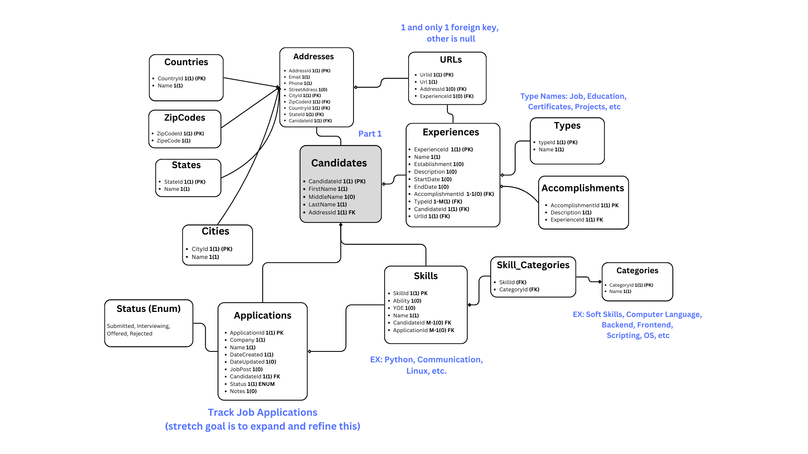

# Job Tailor *CURRENTLY UNDER REWRITE TO JAVA*

> **Intent:** To develop a full-stack application to help job-seekers build their resume quickly
> 
> **Tools:** Java Spring Boot (REST), Docker, PostgresSQL
> 
> **TBD Goals:** Front End framework selection, Python or Node to make PDF (either with a library or as a microservice), ChatGPT integration to help match skills, Deployment to cloud

## Draft of Relational Database Design:

